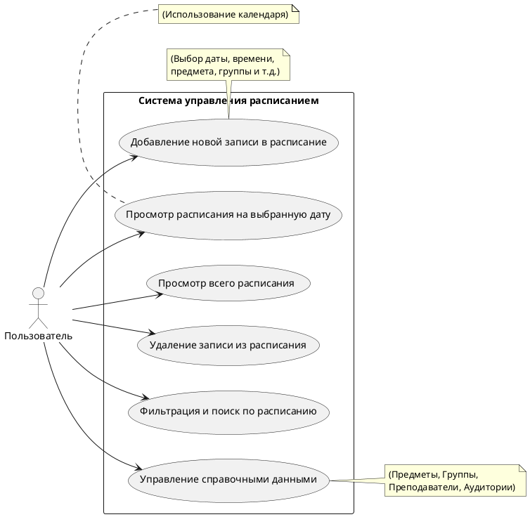
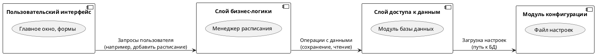
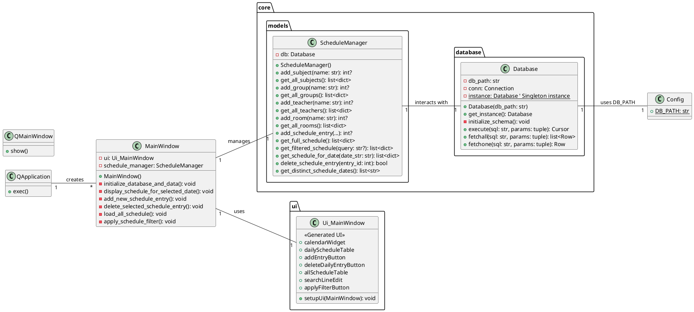

# Система управления расписанием

## Описание проекта
Система управления расписанием (Schedule Management System) - это настольное приложение, разработанное на Python с использованием фреймворка PySide6 (Qt for Python). Приложение позволяет пользователям удобно просматривать, добавлять, редактировать и удалять записи расписания занятий, встреч или других событий. Данные хранятся в локальной базе данных SQLite.

### Ключевые особенности:
* **Просмотр расписания:** Отображение расписания в удобном табличном виде с возможностью фильтрации по дате и общим параметрам.
* **Добавление, редактирование, удаление:** Полный набор CRUD-операций для управления записями расписания, включая предметы, группы, преподавателей и аудитории.
* **Календарь:** Интегрированный календарь для наглядного выбора даты и выделения дней с событиями.
* **Поиск и фильтрация:** Мощные функции поиска по предмету, группе, преподавателю или аудитории, а также фильтрация по дате.
* **Автоматическая инициализация данных:** При первом запуске приложение автоматически создает базу данных и может заполнять ее тестовыми случайными данными для демонстрации функционала.
* **Чистая архитектура:** Разделение логики на слои (UI, бизнес-логика, база данных) для улучшения читаемости, поддерживаемости и масштабируемости кода.

## Структура проекта

```
schedule-app/
├── core/
│   ├── __init__.py
│   ├── database.py           # Модуль для взаимодействия с БД (инициализация, CRUD-операции)
│   └── models.py             # Модуль для бизнес-логики (ScheduleManager)
├── ui/
│   ├── __init__.py
│   ├── main_window.py        # Сгенерированный UI-код из Qt Designer (Ui_MainWindow)
│   └── main_window.ui        # Файл дизайна UI для Qt Designer
├── config.py                 # Файл конфигурации (например, путь к файлу БД)
├── main.py                   # Основной файл приложения (класс MainWindow), объединяет UI и логику
└── run.py                    # Точка входа в приложение
```

## Установка и запуск

Для запуска приложения выполните следующие шаги:

1.  **Клонируйте репозиторий:**
    ```bash
    git clone [https://github.com/your-username/schedule-app.git](https://github.com/your-username/schedule-app.git)
    cd schedule-app
    ```
    *(Замените `https://github.com/your-username/schedule-app.git` на актуальный URL вашего репозитория)*

2.  **Создайте и активируйте виртуальное окружение (рекомендуется):**
    ```bash
    python -m venv venv
    # Для Windows:
    .\venv\Scripts\activate
    # Для macOS/Linux:
    source venv/bin/activate
    ```

3.  **Установите зависимости:**
    ```bash
    pip install PySide6
    # Если у вас есть файл requirements.txt, используйте:
    # pip install -r requirements.txt
    ```

4.  **Запуск приложения:**
    ```bash
    python run.py
    ```

При первом запуске база данных `schedule.db` будет автоматически создана в папке `data/` (согласно настройкам в `config.py`) и заполнена тестовыми данными.

## UML Диаграммы

### 1. Как пользоваться приложением (Диаграмма вариантов использования)

Эта диаграмма иллюстрирует основные действия, которые пользователь может выполнять в системе.



**Описание вариантов использования:**

* **Просмотр расписания на выбранную дату:** Пользователь может выбрать дату в календаре, чтобы увидеть все записи расписания на этот день.
* **Просмотр всего расписания:** Пользователь может просмотреть полную таблицу всех существующих записей расписания.
* **Добавление новой записи в расписание:** Пользователь может добавить новую запись, указав предмет, группу, дату, время начала и окончания, а также опционально преподавателя и аудиторию.
* **Удаление записи из расписания:** Пользователь может удалить одну или несколько выбранных записей из расписания.
* **Фильтрация и поиск по расписанию:** Предоставляет возможность искать записи по различным критериям (предмет, группа, преподаватель или аудитория) или фильтровать общее расписание.
* **Управление справочными данными:** Пользователь может добавлять, просматривать или, возможно, редактировать списки предметов, групп, преподавателей и аудиторий.

### 2. Как устроено приложение (Диаграмма компонентов)

Эта диаграмма дает высокоуровневое представление об архитектуре приложения, показывая его основные логические блоки (компоненты) и их взаимодействие.



**Описание структуры приложения:**

* **Пользовательский интерфейс (UI):** Это то, что видит пользователь. Он отвечает за отображение расписания, форм для ввода данных и обработку пользовательских действий (нажатия кнопок, выбор дат). Создан с помощью PySide6.
* **Слой бизнес-логики:** Содержит основную логику приложения, связанную с управлением расписанием. Здесь происходит добавление, удаление, фильтрация и получение записей расписания, а также управление справочными данными (предметы, группы и т.д.).
* **Слой доступа к данным:** Отвечает за взаимодействие с базой данных. Он предоставляет методы для выполнения SQL-запросов (чтение, запись, обновление, удаление данных) и абстрагирует бизнес-логику от деталей работы с базой данных. Использует SQLite.
* **Модуль конфигурации:** Хранит глобальные настройки приложения, такие как путь к файлу базы данных, обеспечивая легкую настройку без изменения основного кода.

### 3. Подробная UML-диаграмма классов

Эта диаграмма детализирует основные классы приложения, их атрибуты, методы и взаимосвязи, включая ключевые классы PySide6, которые используются в логике.



**Описание диаграммы классов:**

* **QApplication, QMainWindow, и другие классы PySide6:** Представляют основные компоненты фреймворка Qt, используемые приложением. `QApplication` управляет основным циклом событий, а `QMainWindow` служит базой для главного окна приложения.
* **Database (core.database):** Реализует паттерн Singleton для обеспечения единой точки доступа к базе данных SQLite. Предоставляет методы для выполнения SQL-запросов и управления схемой БД.
* **ScheduleManager (core.models):** Инкапсулирует основную бизнес-логику приложения. Он использует `Database` для взаимодействия с БД и предоставляет высокоуровневые методы для добавления, получения, фильтрации и удаления записей расписания, а также управления справочными данными (предметы, группы и т.д.).
* **Ui_MainWindow (ui):** Это класс, который генерируется автоматически из `.ui` файла Qt Designer. Он содержит определения всех виджетов пользовательского интерфейса (кнопки, таблицы, поля ввода и т.д.) и метод `setupUi` для их инициализации.
* **MainWindow (main.py):** Это основной класс главного окна приложения, который наследуется от `QMainWindow`. Он объединяет сгенерированный UI (`Ui_MainWindow`) с бизнес-логикой (`ScheduleManager`). Здесь происходит привязка событий UI к соответствующим методам, загрузка и обновление данных расписания, а также обработка пользовательского ввода.
* **Config (config.py):** Представлен как класс для наглядности зависимостей, но фактически является модулем, который хранит глобальные настройки приложения, такие как `DB_PATH`.
* **Взаимосвязи:** Диаграмма показывает, как `MainWindow` использует `Ui_MainWindow` для отображения UI и `ScheduleManager` для управления данными. `ScheduleManager`, в свою очередь, взаимодействует с `Database`, которая загружает настройки из `Config`. `run.py` является точкой входа, которая создает экземпляр `QApplication` и `MainWindow`, а затем отображает главное окно.